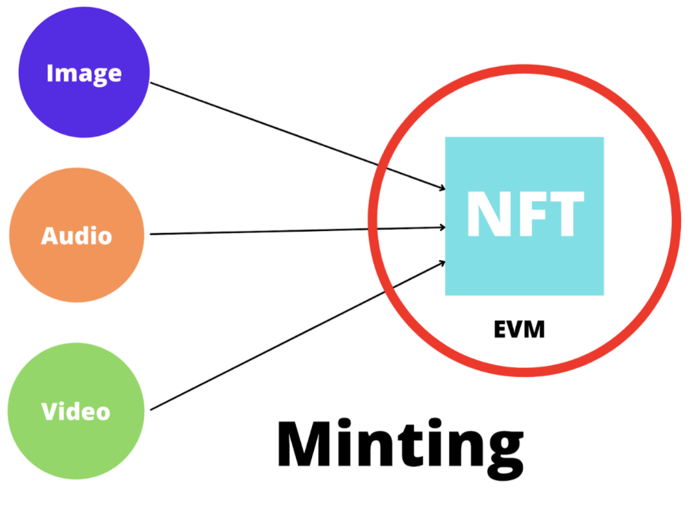

# Minting

Minting refers to turning digital files into a nonfungible token on the Ethereum blockchain; the digital files ( images, audio, video ) stored in this decentralized database will be impossible to modify or delete.
